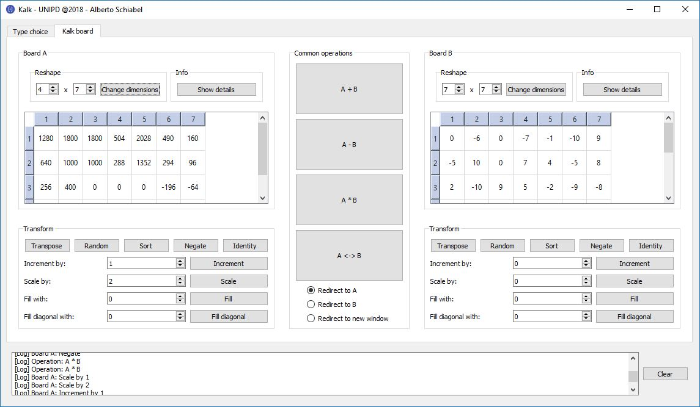

# Kalk

Kalk is the final project developed for the **Object Oriented Programming** Course at the University of Padova.
It focuses on linear algebra data structures and operations. Multiple types of matrices can be combined,
and each of them has its own custom methods.

## Description

Kalk is structured into two different subprojects. Both heavily implement templating, inheritance, polymorphism
and **S.O.L.I.D.** principles, as required by the specifics, which can be found [here](specificaProgetto.pdf) (they are only available in Italian).
The custom library that handles linear algebra operations and data structures is separated from the rest of the code and
is heavily commented.

Please check out the [essay](relazione.pdf) that discusses the project in great detail and explains its class hierarchy.

### kalk-cpp

This folder contains the code for a desktop application written in C++ using the Qt framework. It implements
the Model-View-Controller pattern as well as separation of concerns. Every visual component is defined in its own class
and receives the data to display from the parent. The core library implements multiple virtual inheritance, and the hierarchy is
displayed below. The code aims to be easily extendible thanks to the use of multiple abstract classes and virtual iterators.

### kalk-java

This folder contains the Java equivalent of the kalk-cpp/lib folder, so it is the Java implementation of the
core library that is leveraged by the desktop app. It's main class, Use.java, has the only purpose of displaying
sample usages of the different classes of the hierarchy. Due to the usage of Streams, it requires Java 8.

## Notes

While developing this project, the focus was on the following requirements:
- polymorphism
- separation of concerns
- composability
- OOP
- reactive events (thanks to `Qt::connect`)
- code readability

----------------------------------------------------------------

This project was evaluated 2/2, thus allowing me to complete the OOP University Course with a Mark of 30/30.
